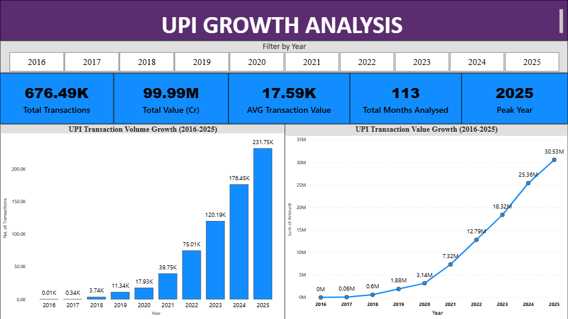
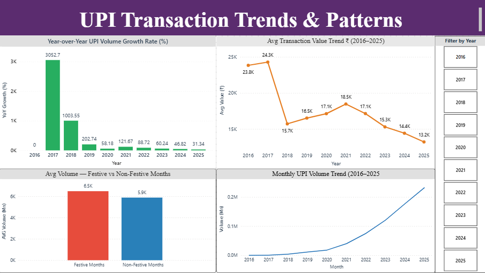
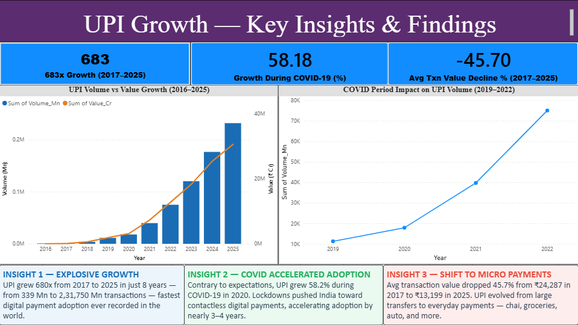

# UPI Growth Analysis — India (2016–2025)


---

## Project Overview

This project analyses nearly a decade of UPI (Unified Payments Interface) transaction data in India.
The goal was not just to build charts — but to find specific, non-obvious business insights from real NPCI government data. 
The project follows a complete end-to-end workflow: Python for cleaning and EDA, SQL for querying, Excel for storage, and Power BI for an interactive 3-page dashboard.

---

## Dashboard Preview

### Page 1 — Overview


### Page 2 — Trends & Patterns


### Page 3 — Key Insights & Findings


---

## Key Findings

| # | Finding | Number |
|---|---------|--------|
| 1 | UPI volume growth from 2017 to 2025 | **683x** (339 Mn to 2,31,750 Mn) |
| 2 | UPI growth during COVID-19 in 2020 | **+58.2% YoY** — accelerated, not slowed |
| 3 | Change in average transaction value | **-45.7%** (Rs.24,287 to Rs.13,199) |
| 4 | Festive months vs non-festive months | **+10.2%** higher average volume |
| 5 | YoY growth rate in 2025 | **31.3%** — market maturing, not declining |
| 6 | Total value processed in 2025 alone | **Rs.305.33 Lakh Crore** |
| 7 | Total months of data analysed | **113 months** (Aug 2016 to Dec 2025) |
|

---

## Tools and Technologies

| Tool | Purpose |
|------|---------|
| Python 3.14 | Data cleaning, EDA, chart generation |
| pandas | Data manipulation, aggregation, feature engineering |
| matplotlib | Static chart generation (7 charts) |
| seaborn | Heatmap and statistical visualizations |
| SQL (SQLite) | Data querying — 5 analytical queries |
| Microsoft Excel | Cleaned data storage and summary tables |
| Power BI | 3-page interactive dashboard with DAX measures |
| Jupyter Notebook | End-to-end documented analysis (19 cells) |

---

## Project Structure

```
upi-growth-analysis/
├── data/
│   └── upi_india_monthly_enriched.csv      # Raw dataset — NPCI sourced
├── notebooks/
│   └── upi_analysis.ipynb                  # Full analysis — 19 cells with outputs
├── output/
│   ├── upi_cleaned.xlsx                    # Cleaned monthly data (113 rows)
│   ├── upi_yearly_summary.xlsx             # Yearly aggregated summary
│   ├── upi_database.db                     # SQLite database for SQL queries
│   ├── chart1_volume_growth.png
│   ├── chart2_value_growth.png
│   ├── chart3_yoy_growth.png
│   ├── chart4_seasonality_heatmap.png
│   ├── chart5_avg_txn_value.png
│   ├── chart6_festive_vs_nonfestive.png
│   └── chart7_covid_impact.png
├── screenshots/
│   ├── page1_overview.png
│   ├── page2_trends.png
│   └── page3_insights.png
├── UPI_Growth_Analysis_SKA_Sameer.pbix
└── README.md
```

---

## Data Source

- **Source:** NPCI — National Payments Corporation of India (npci.org.in)
- **Period:** August 2016 to December 2025
- **Records:** 113 monthly rows, 21 columns
- **Key fields:** Volume_Mn, Value_Cr, Volume_YoY_%, Volume_MoM_%, Is_Festive_Season, Is_Covid_Period, Financial_Year

---

## Step 1 — Data Cleaning (Python)

```python
import pandas as pd

df = pd.read_csv('../data/upi_india_monthly_enriched.csv')
df['Date'] = pd.to_datetime(df['Date'])

# Remove pre-launch zero rows (UPI launched August 2016)
df = df[df['Volume_Mn'] > 0].reset_index(drop=True)

# Engineer new features
df['Avg_Txn_Value'] = (df['Value_Cr'] / df['Volume_Mn']) * 100
df['Festive_Label'] = df['Is_Festive_Season'].map({1: 'Festive Months', 0: 'Non-Festive Months'})
df['Covid_Label'] = df['Is_Covid_Period'].map({1: 'COVID Period', 0: 'Normal Period'})

# Replace infinity values from first month MoM calculation
df['Volume_MoM_%'] = df['Volume_MoM_%'].replace([float('inf'), float('-inf')], 0)


# Output — Shape: (113, 21) | Date range: Aug 2016 to Dec 2025 | Power BI dashboard shows 2016–2025
```

---

## Step 2 — Year-wise Aggregation (Python)

```python
yearly = df.groupby('Year').agg(
    Total_Volume_Mn=('Volume_Mn', 'sum'),
    Total_Value_Cr=('Value_Cr', 'sum'),
    Avg_Txn_Value=('Avg_Txn_Value', 'mean')
).reset_index()

yearly['Volume_YoY_Growth'] = yearly['Total_Volume_Mn'].pct_change() * 100
yearly = yearly.round(2)
```

---

## Step 3 — SQL Queries (SQLite)

```python
import sqlite3

conn = sqlite3.connect('../output/upi_database.db')
df.to_sql('upi_monthly', conn, if_exists='replace', index=False)
yearly.to_sql('upi_yearly', conn, if_exists='replace', index=False)
```

### Query 1 — Year-wise KPI Summary
```sql
SELECT Year,
       ROUND(SUM(Volume_Mn), 2) AS Total_Volume_Mn,
       ROUND(SUM(Value_Cr), 2) AS Total_Value_Cr,
       ROUND(AVG(Avg_Txn_Value), 2) AS Avg_Txn_Value
FROM upi_monthly
GROUP BY Year
ORDER BY Year;
```

### Query 2 — Festive vs Non-Festive Comparison
```sql
SELECT
    CASE WHEN Is_Festive_Season = 1
         THEN 'Festive Months'
         ELSE 'Non-Festive Months' END AS Period,
    ROUND(AVG(Volume_Mn), 2) AS Avg_Volume_Mn,
    ROUND(AVG(Value_Cr), 2) AS Avg_Value_Cr,
    COUNT(*) AS Month_Count
FROM upi_monthly
GROUP BY Is_Festive_Season;
```

### Query 3 — COVID Period Analysis (2018-2022)
```sql
SELECT Year,
       ROUND(SUM(Volume_Mn), 2) AS Total_Volume,
       ROUND(SUM(Value_Cr), 2) AS Total_Value,
       MAX(CASE WHEN Is_Covid_Period = 1
           THEN 'COVID Period'
           ELSE 'Normal Period' END) AS Period_Type
FROM upi_monthly
WHERE Year BETWEEN 2018 AND 2022
GROUP BY Year
ORDER BY Year;
```

### Query 4 — Top 10 Highest Volume Months Ever
```sql
SELECT Month_Name, Year,
       ROUND(Volume_Mn, 2) AS Volume_Mn,
       ROUND(Value_Cr, 2) AS Value_Cr
FROM upi_monthly
ORDER BY Volume_Mn DESC
LIMIT 10;
```

### Query 5 — Financial Year Comparison
```sql
SELECT Financial_Year,
       ROUND(SUM(Volume_Mn), 2) AS Total_Volume_Mn,
       ROUND(AVG(Avg_Txn_Value), 2) AS Avg_Txn_Value,
       COUNT(*) AS Months_Count
FROM upi_monthly
GROUP BY Financial_Year
ORDER BY Financial_Year;
```

---

## Step 4 — Python Visualizations (matplotlib and seaborn)

7 charts generated and saved to output/ folder:

| Chart | Type | What it shows |
|-------|------|---------------|
| Chart 1 | Bar chart | Year-wise volume growth 2016-2025 |
| Chart 2 | Line chart | Year-wise value growth in Rs. Crore |
| Chart 3 | Bar chart | YoY growth rate — red to green color coded |
| Chart 4 | Heatmap | Monthly seasonality — year vs month grid |
| Chart 5 | Line chart | Avg transaction value decline trend |
| Chart 6 | Bar chart | Festive vs non-festive volume comparison |
| Chart 7 | Line chart | Full monthly timeline with COVID period |

---

## Step 5 — Key Insights Computed

```python
# Growth multiple — 2017 to 2025
first_full_year = 339       # Mn transactions in 2017
last_year       = 231750    # Mn transactions in 2025
growth = last_year / first_full_year    # 683x

# COVID impact — 2020 vs 2019
covid_growth = ((17930 - 11335) / 11335) * 100     # +58.2%

# Avg transaction value shift
avg_2017 = 24287    # Rs. per transaction
avg_2025 = 13199    # Rs. per transaction
change   = ((13199 - 24287) / 24287) * 100          # -45.7%

# Festive month premium
festive_avg    = 7200   # Mn avg monthly volume
nonfestive_avg = 6300   # Mn avg monthly volume
premium = ((7200 - 6300) / 6300) * 100              # +10.2%
```

---

## Step 6 — Power BI Dashboard (3 Pages)

**Page 1 — Overview**
- 5 KPI cards with DAX measures using ALL() to ignore slicer filters
- Year slicer in tile style for dynamic filtering
- Column chart — year-wise volume growth
- Line chart — year-wise value growth

**Page 2 — Trends and Patterns**
- YoY growth rate bar chart with red to green conditional color
- Avg transaction value line chart showing 45.7% decline
- Monthly volume line chart across all 113 months (Aug 2016 to Dec 2025)
- Festive vs Non-Festive clustered column chart

**Page 3 — Key Insights and Findings**
- 3 insight KPI cards: 683x growth, 58.18% COVID growth, -45.70% value change
- Dual-axis combo chart: volume bars + value line (2016-2025)
- COVID period zoom-in line chart filtered to 2019-2022
- 3 color-coded insight text boxes with business implications

---

## How to Run

```bash
# Clone the repository
git clone https://github.com/sameer-2025-web/upi-growth-analysis.git
cd upi-growth-analysis

# Install dependencies
pip install pandas matplotlib seaborn openpyxl

# Run the notebook
jupyter notebook notebooks/upi_analysis.ipynb
```

Open `UPI_Growth_Analysis_SKA_Sameer.pbix` in Power BI Desktop and click Refresh if prompted.

---

## Author

**SK Ahamed Sameer**
- Email: skasameer8919@gmail.com
- LinkedIn: https://www.linkedin.com/in/shaik----sameer
- GitHub: https://www.github.com/sameer-2025-web

---

## Acknowledgements

Data sourced from NPCI official monthly statistics — npci.org.in
